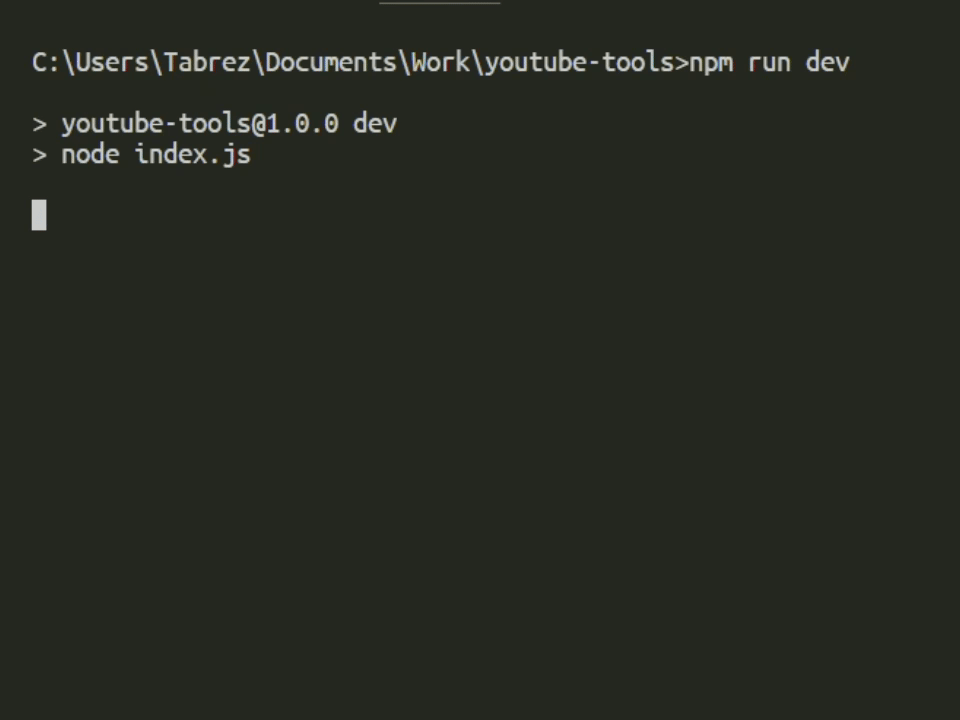

# YouTube Tools

A small Node.js utility that extracts visible data from a YouTube video page (title, channel, views, comments) and can scrape live chat messages. The project uses Playwright for reliable page rendering and a set of focused page extractors in `youtube-page.js`.

## Quick start

1. Install dependencies:

   ```bash
   npm install
   npx playwright install
   ```

2. Run (headless by default):

   ```bash
   npm start
   # or
   node index.js
   ```

   For testing you can hardcode a URL in `index.js` so the script skips the prompt:

   ```javascript
   // For testing, you can hardcode a YouTube URL here. If left empty, the script will prompt you to enter one.
   let url = "https://www.youtube.com/watch?v=AjWfY7SnMBI";
   ```

3. View browser UI / debug:

   ```bash
   PLAYWRIGHT_HEADLESS=false npm start
   ```

## Demo ▶️



A short recording of the extractor running headful (shows title, channel, views extraction).

## What it extracts 🔍

- `title`, `channel`, `views`, `comments` from the video page
- (optional) live chat messages when a live stream is active
- Extractors avoid skeleton placeholders by waiting for rendered content
## Intended use & data policy

This project is intended for:

- Demonstration
- Research
- Personal tooling

Policy

- [x] Scrape public metadata only

Safe data this tool collects (examples):

- Titles
- Video IDs
- Channel names
- Thumbnails
- Publish dates

Do not attempt to access private, paid, age-gated, or members-only content. Obtain restricted data only through official APIs and with proper authorization. Respect YouTube's terms of service and applicable law; use this tool only for non-abusive, personal research or learning.
## Important files

- `index.js` — CLI + orchestration
- `youtube-page.js` — page extractor helpers
- `playwright-config.js` — Playwright launcher + defaults
- `.vscode/launch.json` — debugging configs

## Configuration & debugging

- Toggle headless: `PLAYWRIGHT_HEADLESS=true|false` (default: `true`).
- Persistent profile directory: `playwright-data` (used when running headful to persist cookies).
- Use the included VS Code launch configs to debug Node and attach to the browser.

## Troubleshooting

- Channel/views/comments return `null` — try `PLAYWRIGHT_HEADLESS=false` once so the page fully renders (sign in if needed).
- If values are still missing, the page may be heavily throttled or selectors changed — open the page in headful mode and inspect the DOM.

> Respect YouTube's terms of service. Use this tool for personal, non-abusive testing only.

---

If you want: JSON output, numeric-normalized counts, or CI tests — I can add those next.
